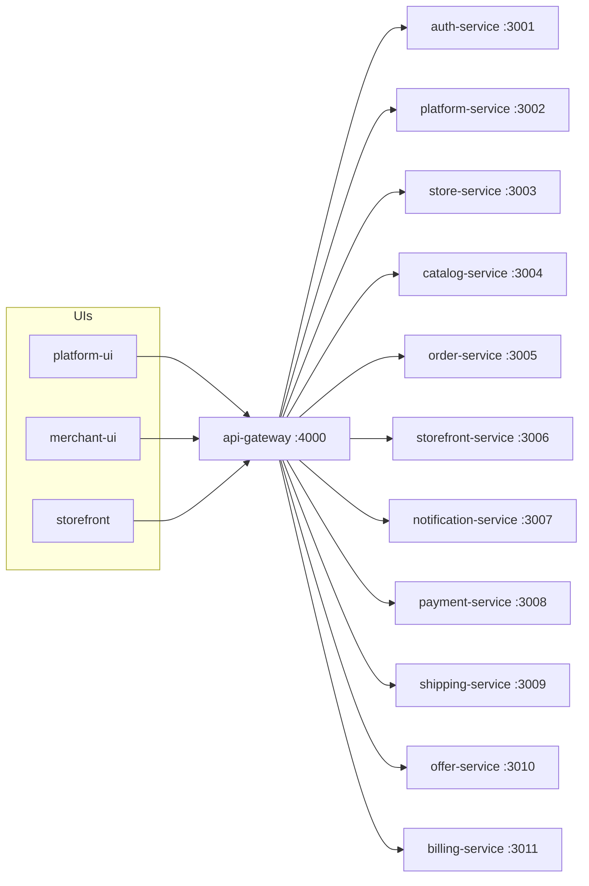
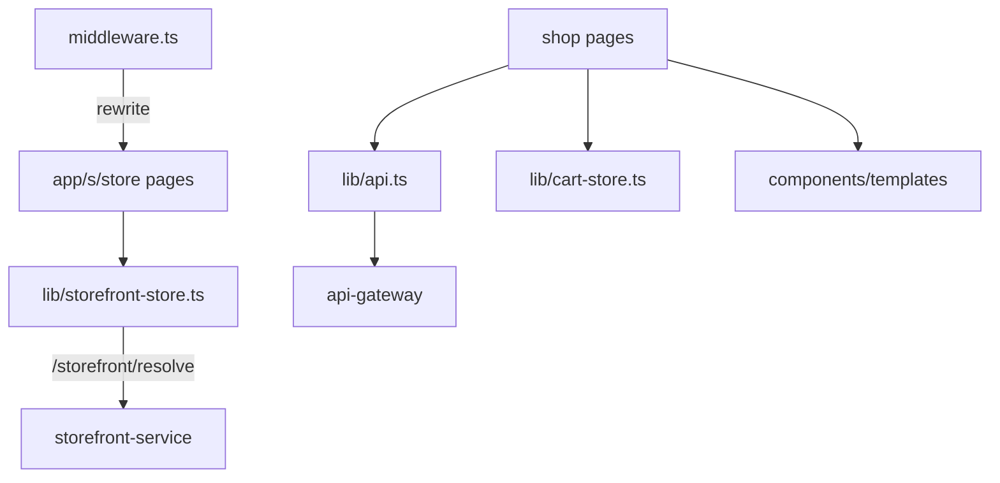

# Knowledge graph — storefront

## This repo

## Important paths

| Path | File |
| --- | --- |
| `/s/[store]` home | `app/s/[store]/page.tsx` |
| Products | `app/s/[store]/products/page.tsx`, `products/[id]/page.tsx` |
| Cart/checkout | `app/s/[store]/cart/page.tsx`, `checkout/page.tsx` |
| Auth | `app/s/[store]/login/page.tsx`, `register/page.tsx`, `profile/page.tsx` |
| CMS page | `app/s/[store]/p/[slug]/page.tsx` |
| Manifest | `app/api/manifest/route.ts` |

## Task → file

- Domain routing bug: `middleware.ts` then storefront-service `resolve`.
- Cart: `lib/cart-store.ts` plus cart/checkout pages.
- Theme/template: `lib/theme-store.ts`, `components/templates/TemplateWrapper.tsx`.
